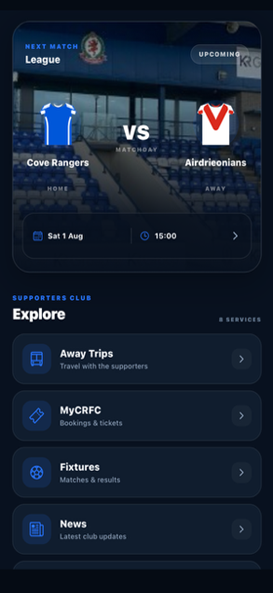
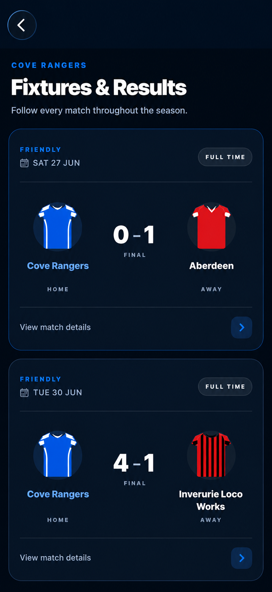
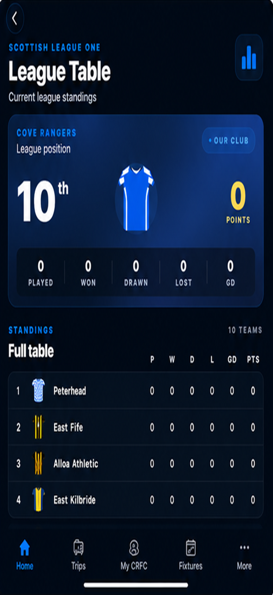

# Cove Rangers Supporters Club — Mobile App

> A production mobile application built for Cove Rangers Supporters Club using React Native, Expo and Firebase.

## Project Overview

The Cove Rangers Supporters Club app is a mobile platform I designed and developed to provide supporters with a central place for club information, match updates, membership services and supporters' travel.

Unlike a portfolio or demonstration project, the application was developed for a real organisation and has been deployed for use by supporters.

The app combines supporter-facing features with role-based administration tools, allowing authorised users to manage content and match information directly from the application.

## Key Features

### Supporter Features

- Upcoming fixture and match information
- Live match status, scores and match events
- Full fixture list and match details
- League table
- Club and supporters' news
- Away travel information and booking
- Personal travel booking history
- Supporters Club membership registration
- Secure user authentication

### Administration

- Role-based administrator access
- Fixture and result management
- Live match control, including goals, cards and match events
- Supporters' travel management
- Seat availability and booking management
- News management
- League table administration

The application uses Firebase Authentication and Firestore to provide shared, real-time data between supporters and authorised administrators.

## Application Screenshots

  
  &nbsp;&nbsp;
  
  &nbsp;&nbsp;
  

## Technology Stack

| Technology | Use in the Application |
|---|---|
| React Native | Cross-platform mobile application development |
| JavaScript | Application logic and user interface |
| Expo | Development, testing and application builds |
| Firebase Authentication | Secure user authentication |
| Cloud Firestore | Real-time application data and content storage |
| Firebase Admin SDK | Role-based administrative access |
| React Navigation | Application navigation and screen structure |
| Git / GitHub | Version control and project repository |
  <em>Home dashboard, fixtures and results, and league standings.</em>

## Production Use

The application was developed for Cove Rangers Supporters Club and has progressed from development and testing into real-world use.

The project involved the complete application lifecycle, including:

- Requirements based on the needs of a real supporters' organisation
- Mobile interface and user-experience design
- React Native application development
- Firebase backend and authentication integration
- Role-based administration functionality
- Testing with real users
- iOS build, TestFlight testing and production deployment
- Ongoing maintenance and feature development

Working with a live application has also required consideration of data integrity, authentication, user permissions and maintaining functionality while updates are introduced.

## Project Status

The application is in production use and continues to receive maintenance and feature updates.

This repository serves as a portfolio showcase of the project. Source code, Firebase configuration, credentials and other security-sensitive application data are not included in the public repository.

---

**David Robertson**  
Software Developer | Technical Specialist
